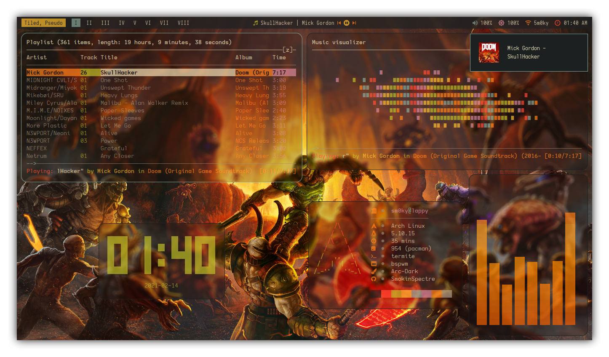

### Thanks For Visiting! :octocat:

I Hope You Understand Everything Here :wink:

Here Are The Details About My Current Desktop Setup:

- **Distro**                   : [Arch](https://archlinux.org/)
- **Window Manager**           : [BSPWM](https://github.com/baskerville/bspwm)
- **Prompt**                   : [StarShip](https://starship.rs/)
- **Terminal**                 : [Termite](https://github.com/thestinger/termite/)
- **Panel**                    : [PolyBar](https://github.com/polybar/polybar)
- **Compositor**               : [Picom](https://github.com/yshui/picom)
- **Notifications Daemon**    : [Dunst](https://github.com/dunst-project/dunst)
- **Application Launcher**    : [Rofi](https://github.com/davatorium/rofi)
- **File Manager**            : [Thunar](https://github.com/ranger/ranger)
- **Text Editor**             : [Vim](https://github.com/vim/vim)

   

  

## 🌸 Cherry

  

## 🎀 Fortune
 

  

## 🌈 Orion
 

  

## 🔥 Doom

